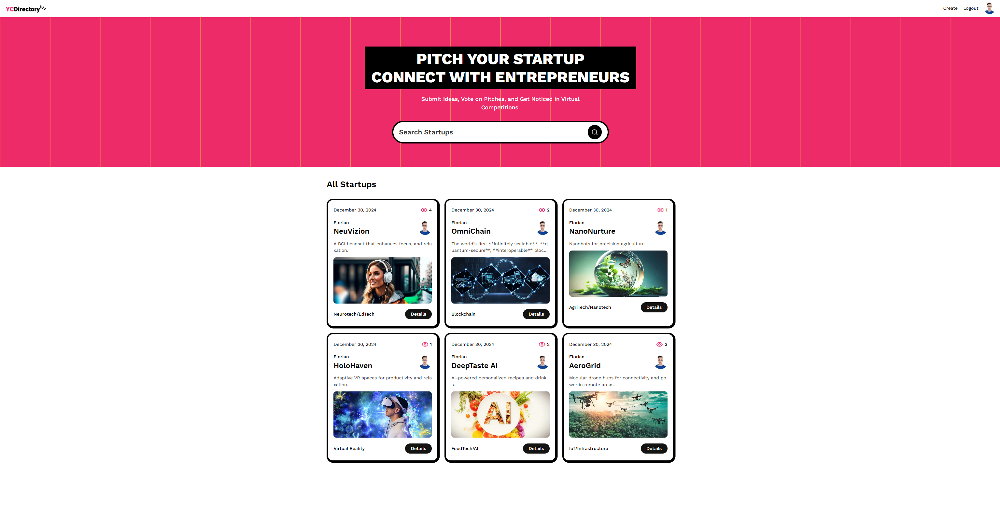
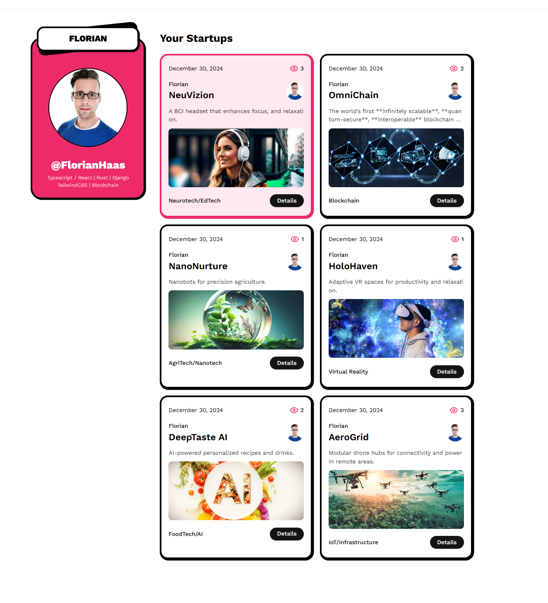
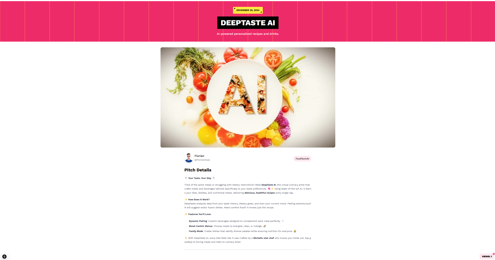
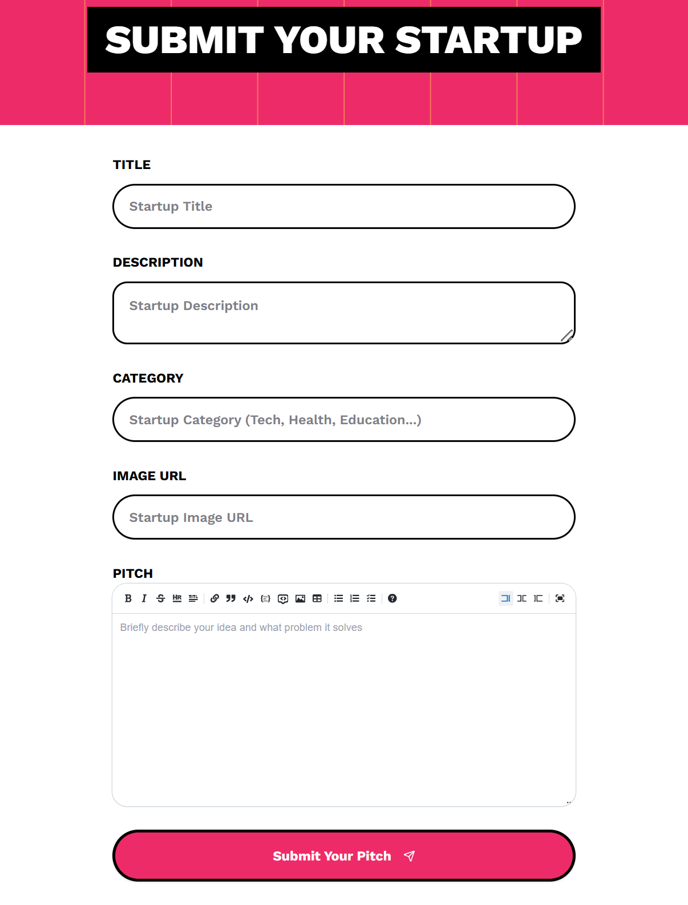

# Startup

## Overview



This project demonstrates a comprehensive implementation of **Next.js 15** features, including advanced folder structure, client and server components, routing, data fetching strategies, authentication, caching, and more. The application includes:
- **Startup Detail Page:** Provides detailed information about a specific startup.
- **Profile Page:** Lists all startups with links to their detailed pages.
- **GitHub Login:** Enables authentication using GitHub OAuth.
- **StartupCreate Page:** Allows users to create new startup entries with a built-in markdown editor.

---

## Features and Highlights

### 1. **Next.js 15 Folder Structure**
- Organized using the **App Directory** to streamline the project structure.
- Enables better organization of components, layouts, and pages.

### 2. **Client Components vs Server Components**
- Efficiently splits logic between client-side and server-side components.
- Ensures a seamless user experience with optimized rendering.

### 3. **File-based Routing**
- Includes support for dynamic, nested routes, and route groups.
- Leverages file naming conventions for declarative routing.

### 4. **Special Files**
- Utilizes special files such as:
  - `page.js`: Defines individual pages.
  - `layout.js`: Defines layouts for pages and groups.
  - `loading.js`: Implements loading states.
  - `error.js`: Handles errors gracefully.

### 5. **Serverless Route Handlers**
- Implements Next.js **API routes** for serverless operations.
- Includes support for full-stack application development.

### 6. **Metadata and SEO**
- Dynamic and static metadata management.
- Optimized for **Search Engine Optimization (SEO)**.

### 7. **Data Fetching Strategies**
- Multiple methods of fetching data, including:
  - **Server Side Rendering (SSR):** Fetch data on every request.
  - **Static Site Generation (SSG):** Build static pages at compile time.
  - **Incremental Static Generation (ISR):** Rebuild parts of the site as needed.
  - **Partial Pre-rendering (PPR):** Combines static and dynamic rendering.

### 8. **Advanced Caching**
- Optimized caching strategies for faster performance and reduced server load.

### 9. **Server Actions**
- Incorporates Next.js 15 **Server Actions** for streamlined server-side logic execution.

### 10. **Data Fetching and Architecture**
- Supports parallel and sequential data fetching for efficient data handling.
- Aligns with the best practices for modular and scalable data architecture.

### 11. **Experimental Features**
- Explores experimental features such as `unstable_after` for cutting-edge development.

---

## Pages Overview

### **Profile Page**
Lists all startups with:
- Name
- Short description
- Links to detailed pages for each startup



---
### **Startup Detail Page**
Displays detailed information about a specific startup, including:
- Name
- Description
- Founder details
- Tags/categories
- Pitch



---
### **Startup Detail Page**
Counts views in real-time


---

### **GitHub Login**
Provides a secure authentication mechanism using GitHub OAuth. Once logged in, users can access additional features like creating startups.


---

### **Search Bar**
To search for startups and users


---

### **StartupCreate Page**
Allows authenticated users to create new startups with:
- **Name, description, and category input**
- A powerful **Markdown Editor** for rich formatting.



---

## Setup and Installation

1. **Clone the Repository**
   ```bash
   git clone https://github.com/FlorianHaasGitH/NextJs15-StartUpPage.git
